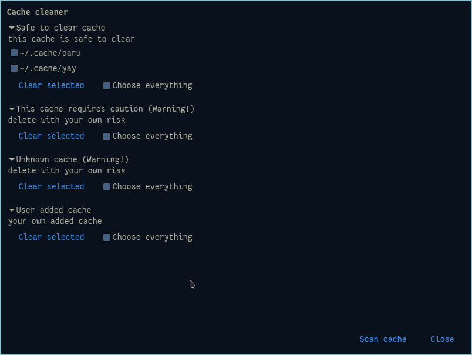

# Cache cleaner

A utility for Linux to free disk space by cleaning caches of
package managers and user-added directories

## Table of contents

- [Status](#status)
- [Screenshots](#screenshots)
- [Features](#features)
- [How it works](#how-it-works)
- [Dependencies](#dependencies)
- [Building from source](#building-from-source)
- [Usage](#usage)
- [Configuration](#configuration)
- [Limitations](#limitations)
- [Known issues](#known-issues)
- [Roadmap](#roadmap)
- [License](#license)
- [Credits](#credits)

## Status

**Alpha (v0.2.0)** — supports `yay`, `paru`, `pip`, `go`, `nuget`, `npm`,
and system caches: `pacman`, `apt`, `dnf`, `flatpak`, `snap`, `journald`.
Supports GUI and CLI modes. Confirmations for dangerous categories, Root-cleaning via polkit.

## Screenshots



## Features

### GUI
- Categories by danger level: Safe, Warning, Unknown, System, User
- Checkboxes for individual paths, "Choose everything" per category
- Confirmation dialogs for dangerous categories (double confirm for Warning/Unknown)
- User files are moved to trash

### CLI
- `--list` — list all caches
- `--delete-safe`, `--delete-warning`, `--delete-unknown`, `--delete-system`, `--delete-user`
- `--tray` — run in tray (planned)

### Cache support
- AUR helpers: `yay`, `paru`
- Languages: `pip`, `go`, `nuget`, `npm`
- System: `pacman`, `apt`, `dnf`, `flatpak`, `snap`
- Logs: `journalctl`

### Config
- `categories.json` — built-in
- `~/.config/cache-cleaner/user_categories.json` — user paths (auto-created)

## How it works

1. Reads `categories.json` (built-in) and `~/.config/cache-cleaner/user_categories.json` (user)
2. Displays them in the window as checkboxes, grouped by danger level
3. When you click **Clear selected**:
   - **User caches** are moved to trash
   - **System caches** are cleared via `pkexec` (sudo command)
4. Confirmation dialogs for `Warning` / `Unknown` categories

## Dependencies

- A C++20 compiler (GCC 10+ or Clang 11+)
- CMake 3.16+
- nlohmann-json
- gtkmm-3.0 (is needed for GUI compilation)

## Building from source

```bash
git clone https://github.com/eufjdknasquwy/cache-cleaner-linux
cd cache-cleaner-linux
cmake -B build -S .
cmake --build build
```

## Usage

### GUI
1. Build the project (see above)
2. Run:
   ```bash
   ./build/cache-cleaner
   ```
3. Select the caches you want to clean and confirm.

### CLI
See --help of program to use CLI utils

## Configuration

`~/.config/cache-cleaner/user_categories.json` - path to user-added cache paths. Created automatically on the first run

Example:

```json
{
  "categories": [
    {
      "category": "User",
      "danger_level": "User",
      "paths": [
        "~/.cache/my-app",
        "~/.local/share/my-app/cache"
      ]
    }
  ]
}
```

## Limitations

- Linux only
- Root caches require polkit agent
- On headless servers, use CLI mode (`--list`, `--delete-x`); root caches need
  `sudo` manually

## Known issues (problems)

- `user_categories.json` may crash the program on parse error
- No `--dry-run` yet
- No `--yes` flag for scripts / cron
- No report after cleaning
- No fallback to `sudo` if `pkexec` is unavailable

## Roadmap

### Done
- [x] Cleaning package manager caches (`yay`, `paru`, `pip`, `go`, `nuget`, `npm`)
- [x] System caches via polkit (`pacman`, `apt`, `dnf`, `flatpak`, `snap`)
- [x] Systemd logs (`journalctl`)
- [x] Confirmation dialogs for dangerous categories
- [x] Root-cleaning via `pkexec`
- [x] Basic CLI mode (`--list`, `--delete-x`)

### Planned
- [ ] App tray
- [ ] GTK4
- [ ] `--dry-run`
- [ ] `--yes` for scripts
- [ ] Report after cleaning
- [ ] Better security

## License

MIT - see [LICENSE](LICENSE).

## Credits

- [gtkmm](https://github.com/GNOME/gtkmm) - GUI
- [nlohmann/json](https://github.com/nlohmann/json) - JSON configurations
